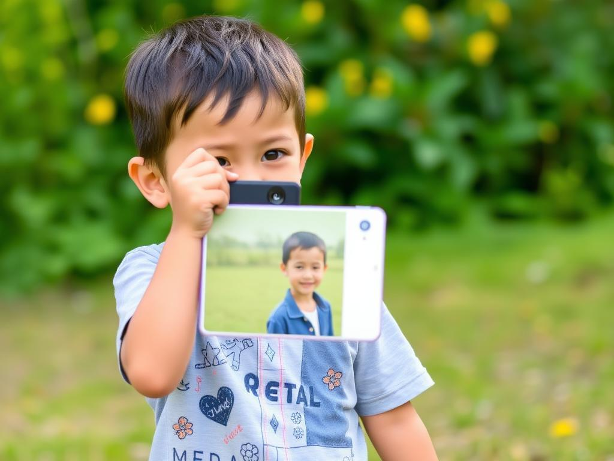

---

# 🪄 Text-to-Image Generator (Flask + Hugging Face API)

A simple yet elegant **Text-to-Image Generator** web app built with **Flask**, **Hugging Face Inference API**, and **HTML/CSS/JS**.
It allows users to input a text prompt and generate an AI-powered image using the `black-forest-labs/FLUX.1-schnell` model, then download or share it.

---

## 🚀 Features

* **AI Image Generation** from text prompts using Hugging Face API.
* **Beautiful UI** with animations, gradients, and particle effects.
* **Download Functionality** to save the generated image.
* **Error Handling** for API issues and unexpected failures.
* **Social Sharing** (Facebook, GitHub, Twitter).
* **Responsive Design** for mobile and desktop.

---

## 📦 Tech Stack

* **Backend:** Python, Flask
* **Frontend:** HTML, CSS (custom animations), JavaScript
* **AI Model:** [black-forest-labs/FLUX.1-schnell](https://huggingface.co/black-forest-labs/FLUX.1-schnell)
* **API Provider:** Hugging Face Inference Client (`huggingface_hub`)

---

## 📂 Project Structure

```
.
├── app.py                # Main Flask application
├── templates/
│   └── index.html        # Frontend HTML template
├── static/
│   └── ma.jpg            # Generated image storage
├── requirements.txt      # Python dependencies
└── README.md             # Project documentation
```

---

## ⚙️ Installation & Setup

### 1️⃣ Clone the Repository

```bash
git clone https://github.com/yourusername/text-to-image-flask.git
cd text-to-image-flask
```

### 2️⃣ Create a Virtual Environment

```bash
python -m venv venv
source venv/bin/activate  # Linux/Mac
venv\Scripts\activate     # Windows
```

### 3️⃣ Install Dependencies

```bash
pip install -r requirements.txt
```

### 4️⃣ Set Up Environment Variables

Replace your **Hugging Face API Key** in `app.py`:

```python
client = InferenceClient(
    provider="together",
    api_key="your_huggingface_api_key"
)
```

> **Tip:** For security, store your API key in `.env` and load it using `python-dotenv`.

### 5️⃣ Run the App

```bash
python app.py
```

Your app will run at: **[http://127.0.0.1:5000](http://127.0.0.1:5000)**

---

## 📜 Usage

1. Open the app in your browser.
2. Enter a descriptive prompt (e.g., *"A futuristic cyberpunk city at night, neon lights"*).
3. Click **Generate Image**.
4. Wait for the AI to create your masterpiece.
5. Download or share the generated image.

---

## 🖼 Demo Screenshot


*(Replace with your actual screenshot)*

---

## 🛠 Requirements

Add to `requirements.txt`:

```
Flask
huggingface_hub
```

---

## 🛡 Error Handling

* **HfHubHTTPError:** If Hugging Face API returns an error (invalid key, request limit exceeded, etc.).
* **Generic Exceptions:** Catches unexpected issues and displays an error message in the UI.

---

## 💡 Customization

* Change **model** in `app.py` to try different Hugging Face image generation models.
* Modify **styles** in the `<style>` section of `index.html`.
* Add more **social media share buttons** in the template.

---

## 📜 License

This project is licensed under the **MIT License** – feel free to use and modify.

---

## 👨‍💻 Author

**Mahdi Hasan**
🌐 [Facebook](https://www.facebook.com/bk4human) | [GitHub](https://github.com/Mahdi-hasan-shuvo) | [Twitter](https://twitter.com/mahdihasan3666)

---

Do you want me to also make you a **`requirements.txt`** so your project can be installed and run instantly? That would make it fully deployable.


https://github.com/user-attachments/assets/b35a8ca6-d68d-4d25-804b-ba36555b001b

